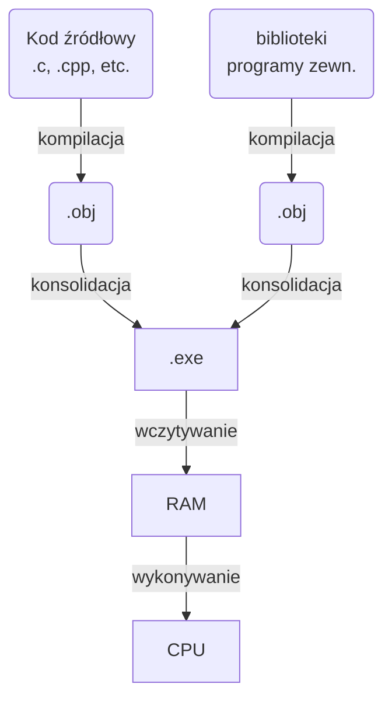

```mermaid
flowchart

src(Kod źródłowy <br> .c, .cpp, etc.)
lib(biblioteki <br> programy zewn.)
obj1(.obj)
obj2(.obj)

direction LR
src --kompilacja--> obj1
lib --kompilacja--> obj2

direction LR
obj1 --konsolidacja--> .exe
obj2 --konsolidacja--> .exe

direction TB
.exe --wczytywanie--> RAM
RAM --wykonywanie--> CPU

```
# [[Kompilacja]]
![[Kompilacja#^5d4ed4]]

# Konsolidacja
# Wczytywanie
# Wykonywanie