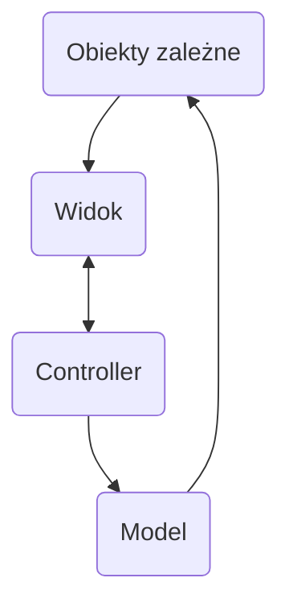

Obiekty zachodzą ze sobą w interakcje (świadczą usługi)

Obiekty są rozproszone

Obiekt = pamięć + operacje

# Klasa
1. **Cluster** funkcji. ([[Ada|Ada83]], Modula-2)
2. Wielokrotne dziedziczenie (C++)
3. Dziedziczenie pojedyncze ([[Smalltalk]])

# Programowanie graficzne

Zmiana *aspektu* modelu wysyła komunikat do Widoku.