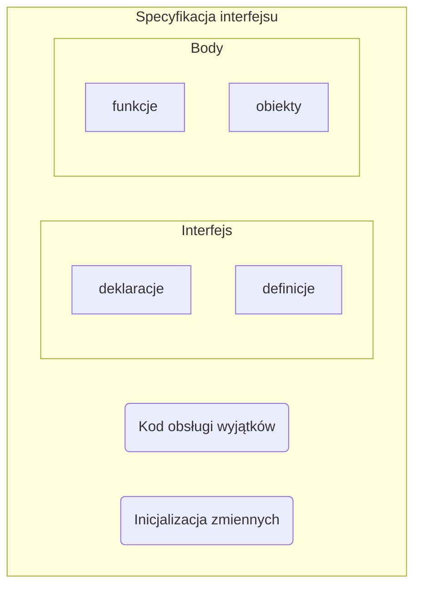

Rozbija kod na *specyfikację* i *implementację*.
Kolejny poziom nad [[Model proceduralny|abstrakcją proceduralną]].
# Specyfikacja interfejsu

# Reguła modularyzacji
>[!quote]
>Moduły nie zakładają o sobie nic poza tym, co zawarte w ich interfejsach.
1. Abstrakcja rozwiązań
> Język obsługuje modularyzację
2. Hermetyzacja rozwiązań
> Dostęp do elementów prywatnych jest zablokowany
3. Lokalizacja
> Modułem można opisać hardware
4. Jednolita reprezentacja
> Specyfikacje modułów używają wspólnego języka
5. Diagnostyka działań
> Moduł eksponuje [[Wyjątek|wyjątki]] i błędy
# Wady
- Efekty uboczne
> Konflikt nazw zmiennych globalnych
- Dostęp niekontrolowany
> Ekspozycja niektórych zmiennych pozwala na ich niepożądaną modyfikację
- Dostęp zagrożony
> Konflikt nazw zmiennych globalnych z lokalnymi

# Ograniczenia
- Dostęp selektywny
> Ekspozycja zmiennych wyłącznie za pomocą [[Podprogram|funkcji]].

# Udogodnienia
- Domyślne wartości argumentów
- Argumenty niezależne od pozycji
- Zmienna liczba argumentów
- Przeciążanie operatorów