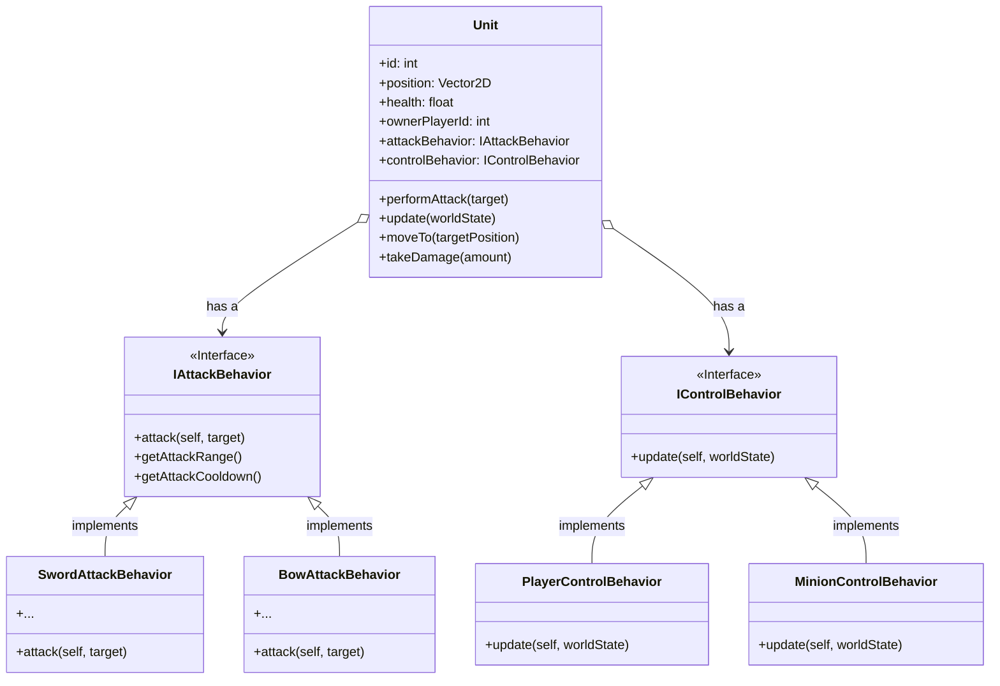

## Podsumowanie Projektu: [sigma]

### 1. Wprowadzenie i Cel

[Twoja Nazwa Gry] to małaskalowa gra strategiczna czasu rzeczywistego (RTS) 2D, zaprojektowana dla dwóch graczy toczących bezpośrednią walkę na ograniczonej mapie.

*   **Cel:** Stworzenie responsywnego i uczciwego doświadczenia wieloosobowego online, w którym każdy gracz bezpośrednio kontroluje jednostkę bohatera, zarządzając jednocześnie stronnikami sterowanymi przez AI, aby pokonać przeciwnika.
*   **Perspektywa:** Widok 2D z góry.
*   **Podstawowe Encje:** Gracze kontrolują jednostkę bohatera; zarówno gracze, jak i AI kontrolują jednostki stronników (Miecznicy, Łucznicy). Encje są wizualnie reprezentowane jako [np. okręgi 2D z ikonami].

### 2. Podstawowe Mechaniki Rozgrywki

*   **Kontrola Bezpośrednia:** Gracze poruszają się i atakują używając jednej, wyznaczonej postaci bohatera.
*   **Kontrola Pośrednia:** Gracze wydają rozkazy wysokiego poziomu (np. przemieść-do-lokacji, zaatakuj-cel) swoim stronnikom.
*   **Walka:** Jednostki walczą w oparciu o typ (wręcz/dystansowy) i rozkazy gracza.
*   **Cel:** [Określ warunek zwycięstwa, np. Wyeliminuj jednostkę bohatera przeciwnika / Zniszcz bazę przeciwnika / Osiągnij określony wynik].

### 3. Architektura Techniczna

*   **Model:** Architektura Klient-Serwer.
*   **Autorytet Serwera:** Serwer jest **autorytatywny**. Symuluje cały stan gry, waliduje wszystkie dane wejściowe od klientów, obsługuje logikę gry (ruch, kolizje, rozstrzyganie walki) i zarządza AI stronników na podstawie rozkazów graczy.
*   **Odpowiedzialność Klienta:** Klienci obsługują dane wejściowe gracza, wysyłają je do serwera, renderują stan gry otrzymany z serwera, wykonują predykcję po stronie klienta dla własnego bohatera gracza i interpolują stan innych encji.
*   **Protokół Komunikacyjny:** **UDP** - Wybrany głównie ze względu na charakterystykę niskiego opóźnienia, kluczową dla responsywności w czasie rzeczywistym w kontroli gracza i walce. Niezawodność jest implementowana selektywnie na warstwie UDP.
*   **Serializacja Danych:** [Określ wybrany format, np. Niestandardowy format binarny, Protobuf, JSON zakończony znakiem NULL]. W załączonym PDF użyto JSON, zauważając jego czytelność, ale potencjalnie większy narzut niż format binarny.
*   **Współbieżność:** [Wspomnij o podejściu, jeśli jest istotne, np. Serwer używa wątków dla operacji sieciowych I/O i głównej pętli gry].

### 4. Kluczowe Decyzje Techniczne i Uzasadnienie

*   **UDP zamiast TCP:** Wybrano w celu minimalizacji opóźnień i uniknięcia blokowania 'head-of-line' (blokowania początku kolejki) właściwego dla TCP, które może powodować zakłócające skoki opóźnień (lag) w grach czasu rzeczywistego. Potrzeba niezawodności jest realizowana ręcznie dla niezbędnych danych.
*   **Autorytatywny Serwer:** Niezbędny do zapobiegania oszustwom (np. hackom po stronie klienta dotyczącym prędkości, obrażeń, pozycji) i zapewnienia spójnego stanu gry dla wszystkich graczy.
*   **Warstwa Niezawodności (na UDP):**
    *   **Numery Sekwencyjne:** Numery sekwencyjne `uint32_t` są dołączane do nagłówka każdego pakietu UDP. Pozwala to odbiorcy (klientowi lub serwerowi) wykrywać utratę pakietów i odrzucać pakiety niekolejne lub zduplikowane. Zawijanie (Wrap-around) jest obsługiwane przy użyciu porównania liczb całkowitych ze znakiem: `(int32_t)(nowy_seq - ostatni_seq) > 0`. Numery sekwencyjne są utrzymywane niezależnie dla każdej pary nadawca-odbiorca.
    *   **Potwierdzenia (ACK):** Dla krytycznych zdarzeń ([Wymień przykłady: np. rzucenie unikalnej umiejętności, potwierdzenie zabójstwa, ostateczny rozkaz dla stronników]), implementowany jest prosty system ACK. Nadawca ponownie wysyła krytyczną wiadomość, dopóki nie otrzyma potwierdzenia ACK od odbiorcy.
*   **Podział Obliczeń Klient-Serwer:**
    *   **Serwer:** Fizyka, wykrywanie kolizji, zasady gry, wykonywanie AI, autorytatywny stan.
    *   **Klient:** Przechwytywanie wejścia, renderowanie, predykcja (własny bohater), interpolacja (inni), interfejs użytkownika (UI).

### 5. Rozwiązywanie Wyzwań Sieciowych Czasu Rzeczywistego

*   **Opóźnienie Wejścia / Reaktywność:**
    *   **Predykcja po Stronie Klienta (CSP - Client-Side Prediction):** Stosowana *tylko* dla bezpośrednio kontrolowanego bohatera gracza. Klient natychmiast symuluje efekt danych wejściowych gracza (np. ruch) i uzgadnia (reconciles) ze stanem autorytatywnym serwera po otrzymaniu aktualizacji, płynnie korygując wszelkie błędy predykcji.
*   **Jitter / Zacinanie Się Zdalnych Encji:**
    *   **Interpolacja Encji:** Klient renderuje zdalne encje (bohatera przeciwnika, wszystkich stronników) w pozycjach interpolowanych między dwoma ostatnio otrzymanymi migawkami stanu serwera. Tworzy to płynny ruch wizualny kosztem niewielkiego opóźnienia wizualnego (zazwyczaj równego interwałowi aktualizacji serwera).
*   **Dokładność / Uczciwość Walki:**
    *   **Kompensacja Opóźnienia ("Favor the Shooter"):** Podczas przetwarzania akcji od klienta (np. wystrzelenie strzały, zamach mieczem), serwer używa oszacowanego opóźnienia klienta, aby "przewinąć" stan potencjalnych celów do miejsca, w którym znajdowały się *na ekranie atakującego*, gdy wysłano dane wejściowe. Wykrywanie trafień jest przeprowadzane w tym historycznie dokładnym stanie.
*   **Zarządzanie Przepustowością:**
    *   **Synchronizacja Stanu:** [Opisz swoją strategię: np. Wysyłanie aktualizacji skompresowanych delta względem ostatniego potwierdzonego stanu; wysyłanie tylko istotnych encji, jeśli ma to zastosowanie; potencjalnie okresowe pełne migawki].

### 6. Obsługa Specyficznych Problemów (Styl FAQ)

*   **Jak radzicie sobie z danymi wejściowymi klienta przychodzącymi z opóźnieniem lub w złej kolejności?**
    *   Serwer przetwarza dane wejściowe na podstawie [np. znaczników czasu lub numerów sekwencyjnych powiązanych z wejściem]. Opóźnione dane wejściowe mogą zostać zastosowane, jeśli są nadal istotne, lub odrzucone, jeśli są zbyt stare. Autorytatywny stan serwera ostatecznie koryguje wszelkie błędne predykcje klienta wynikające z tego.
*   **Co się dzieje, gdy klient przestaje wysyłać informacje?**
    *   Serwer wykrywa brak przychodzących pakietów przez okres czasu oczekiwania (timeout) [np. 5 sekund]. Następnie rozłącza klienta, usuwa jego jednostki z gry i powiadamia pozostałego gracza. Serwer może ekstrapolować ruch cichego gracza przez bardzo krótki czas [np. 0,5 sekundy] przed jego zamrożeniem.
*   **Co się dzieje, gdy serwer przestaje wysyłać informacje?**
    *   Klient wykrywa brak pakietów serwera przez okres czasu oczekiwania. Próbuje ekstrapolacji dla zdalnych jednostek przez krótki czas [np. 0,5 sekundy], ale następnie zamraża stan gry i wyświetla komunikat o błędzie połączenia, prawdopodobnie kończąc lokalną instancję meczu.
*   **Jak obsługiwana jest utrata pakietów UDP?**
    *   Utrata jest wykrywana poprzez przerwy w numerach sekwencyjnych. Dla danych niekrytycznych (np. częste aktualizacje pozycji) utrata jest tolerowana; interpolacja pomaga wygładzić brakujące stany. Dla danych krytycznych, mechanizm ACK zapewnia retransmisję aż do pomyślnego dostarczenia.
*   **Jak zapewniacie integralność danych (wiedząc, że cała wiadomość została odebrana)?**
    *   [Wyjaśnij metodę opartą na serializacji: np. Jeśli używany jest JSON zakończony znakiem NULL, bajt NULL oznacza koniec. Jeśli używany jest format binarny, zazwyczaj poprzedzając każdą wiadomość jej długością].

### 7. Potencjalne Przyszłe Ulepszenia

*   [Wymień pomysły na przyszłe prace, np. Więcej typów jednostek, Ulepszone AI, Większe mapy z zarządzaniem zainteresowaniem (interest management), Rankingowy matchmaking, Tryb obserwatora].

