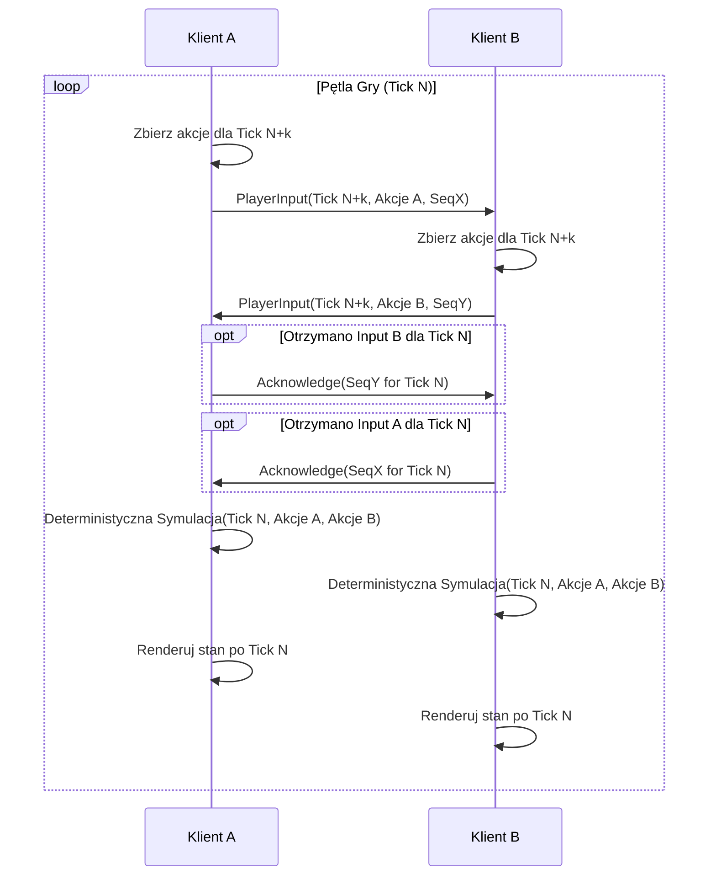
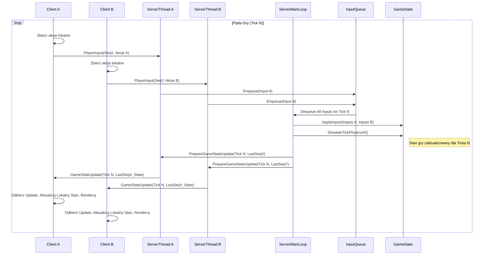
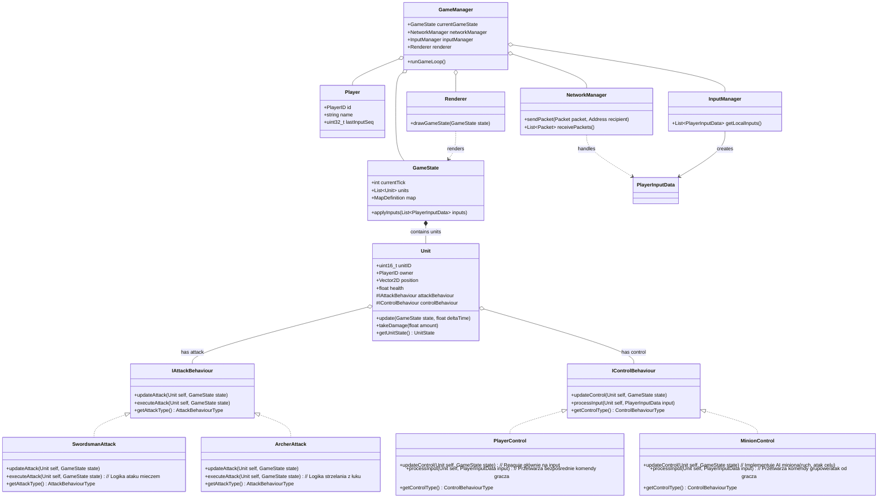
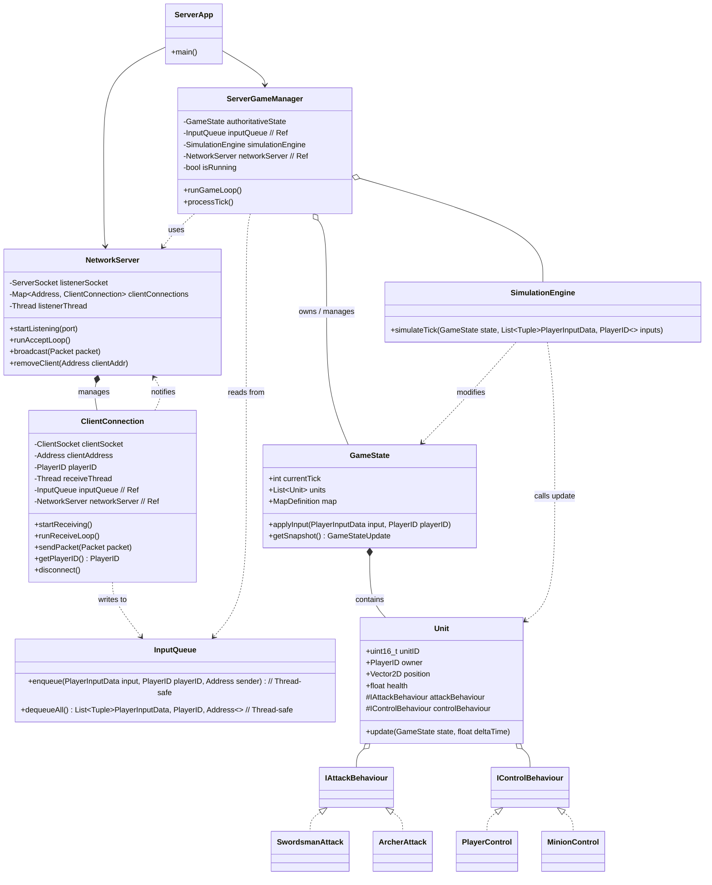

# Mini RTS Arena

## Analiza projektu z przedmiotu Przetwarzanie Rozproszone

## Autorzy: Yauheni Pyryeu 201253, Matsvei Kasparovich 201627

## Data: 10-04-2025

***

## 1. Wstęp

Celem projektu jest stworzenie prototypu gry strategicznej czasu rzeczywistego (RTS) online dla dwóch graczy. Gra osadzona jest w perspektywie top-down 2D na niewielkiej arenie. Każdy gracz bezpośrednio kontroluje jedną jednostkę-bohatera oraz pośrednio zarządza grupą podległych mu jednostek (tak zwanych "minionów"). Jednostki (bohaterowie i miniony) mogą pełnić funkcje Łucznika lub Miecznika. Kluczowym założeniem technicznym jest wykorzystanie protokołu **UDP** do komunikacji sieciowej oraz zbadanie implementacji w architekturach **Klient-Serwer** oraz **Peer-to-Peer (P2P)**.

### 1.1 Przykładowy widok gry

![[widok.png]]

***


<div style="page-break-after: always;"></div>


## 2. Architektura Sieciowa

W projekcie rozważane i badane są dwie architektury sieciowe, obie wykorzystujące protokół UDP:

### 2.1. Klient-Serwer (Client-Server)

*   **Opis:** Dedykowany serwer jest **autorytatywnym źródłem stanu gry**. Klienci wysyłają akcje (input) do serwera. Serwer symuluje grę, rozstrzyga konflikty i rozsyła aktualny stan do klientów.
*   **Zalety:**
    *   Łatwiejsze zarządzanie stanem gry i synchronizacją.
    *   Łatwiejsze zapobieganie oszustwom (cheating).
    *   Centralna walidacja akcji.
*   **Wady:**
    *   Pojedynczy punkt awarii (SPoF).
    *   Potencjalnie wyższe opóźnienie (przez pośrednika).
    *   Wymaga zasobów do hostowania serwera.

### 2.2. Peer-to-Peer (P2P)

*   **Opis:** Klienci komunikują się bezpośrednio. Wymaga to **deterministycznej** symulacji i synchronizacji akcji graczy (np. model "lockstep"). Każdy klient wysyła swoje akcje i czeka na akcje przeciwnika dla danego kroku (ticka) przed wykonaniem symulacji.
*   **Zalety:**
    *   Potencjalnie niższe opóźnienia.
    *   Brak centralnego serwera (brak SPoF, brak kosztów serwera).
*   **Wady:**
    *   Znacznie trudniejsza synchronizacja (ryzyko desynchronizacji).
    *   Problemy z NAT Traversal.
    *   Bardzo podatna na oszustwa.
    *   Wymaga 100% deterministycznej symulacji.

### 2.3. Architektura naszego Projektu

Projekt ma na celu **zbadanie obu podejść**, aby porównać ich złożoność implementacyjną, wydajność i problemy związane z synchronizacją przy użyciu UDP w kontekście gry RTS.

***

<div style="page-break-after: always;"></div>


## 3. Model Komunikacji

### 3.1. Protokół

Wybrano **UDP** ze względu na priorytet niskich opóźnień. Własne mechanizmy będą implementowane dla zapewnienia niezawodności/kolejności tam, gdzie to konieczne (np. dla krytycznych akcji gracza w P2P).

### 3.2. Format Wiadomości

Preferowany jest **zwarty format binarny** nad tekstowym (np. JSON) dla minimalizacji narzutu pakietów UDP. Każdy pakiet rozpoczyna się 1-bajtowym `PacketID`.

**Podstawowe Struktury Danych (Przykłady C++):**
```cpp
struct Vector2D { float x, y; };

// Enum określający typ *zachowania* ataku, a nie typ jednostki jako całości
enum AttackBehaviourType : uint8_t { SWORDSMAN_ATTACK = 0, ARCHER_ATTACK = 1 };
// Enum określający typ *zachowania* kontroli
enum ControlBehaviourType : uint8_t { PLAYER_CONTROL = 0, MINION_CONTROL = 1 };

enum PlayerID : uint8_t { PLAYER_1 = 0, PLAYER_2 = 1 }; // Lub dynamiczne ID

// Stan pojedynczej jednostki przesyłany przez sieć
struct UnitState {
  uint16_t unitID;              // Unikalne ID jednostki
  PlayerID owner;
  AttackBehaviourType attackType; // Jaki typ ataku ma ta jednostka
  ControlBehaviourType controlType; // Jaki typ kontroli ma ta jednostka
  Vector2D position;
  float health;
  // uint8_t stateFlags;        // Np. isAttacking, isMoving, cooldown flags
  // uint16_t targetID;        // ID celu ataku/ruchu
  // Vector2D velocity;        // Prędkość do interpolacji/predykcji
};

// Struktura danych dla akcji gracza
struct PlayerInputData {
    uint8_t inputType;     // Np. 0:GoToPosition, 1:AttackUnit
    Vector2D targetPosition; // Cel ruchu lub ataku pozycyjnego
    uint16_t targetUnitID;   // Cel ataku jednostki
    uint8_t numSelectedUnits; // Liczba jednostek, których dotyczy komenda
    uint16_t selectedUnitIDs[]; // ID jednostek (jeśli numSelectedUnits > 0) - wymaga dynamicznej obsługi rozmiaru pakietu
};
```

***

<div style="page-break-after: always;"></div>


### 3.3. Kluczowe Komunikaty (Format Binarny - Pola Przykładowe)

*   `PacketID = 0x01`: **PlayerInput** (Klient -> Serwer)
    *   `uint32_t sequenceNumber;` // Numer sekwencyjny pakietu od klienta
    *   `uint32_t gameTick;`       // Tick, dla którego klient *przewiduje* wykonanie akcji (może być mniej istotne w C/S niż P2P)
    *   `PlayerInputData data;`    // Właściwe dane akcji

*   `PacketID = 0x02`: **GameStateUpdate** (Serwer -> Klient)
    *   `uint32_t gameTick;`       // Tick stanu serwera
    *   `uint32_t lastProcessedInputSeq;` // Ostatni numer sekwencyjny inputu tego klienta przetworzony przez serwer
    *   `uint16_t numUnits;`       // Liczba jednostek w aktualizacji
    *   `UnitState units[];`      // Tablica stanów jednostek (pełna lub delta)
    *   `float player1Score;`
    *   `float player2Score;`

*   `PacketID = 0x03`: **JoinRequest** (Klient -> Serwer)
    *   `char playerName[16];`    // Nazwa gracza

*   `PacketID = 0x04`: **JoinConfirm / GameInfo** (Serwer -> Klient)
    *   `PlayerID assignedPlayerID;`
    *   `uint32_t initialGameTick;`
    *   `// Info o mapie, początkowe jednostki`

*   `PacketID = 0x05`: **Ping** (Klient -> Serwer)
    *   `uint64_t clientTimestamp;` // Czas wysłania przez klienta

*   `PacketID = 0x06`: **Pong** (Serwer -> Klient)
    *   `uint64_t clientTimestamp;` // Oryginalny timestamp z Ping
    *   `uint64_t serverTimestamp;` // Czas przetworzenia przez serwer

*   `PacketID = 0x07`: **Acknowledge (ACK)** (Serwer -> Klient, opcjonalne, np. dla ważnych wiadomości od serwera)
    *   `// Dane potwierdzanej wiadomości`

***

<div style="page-break-after: always;"></div>


## 4. Działanie Aplikacji

### 4.1. Z Punktu Widzenia Użytkownika

1.  Uruchomienie gry.
2.  Wybór trybu (Klient-Serwer / P2P).
3.  Połączenie / Oczekiwanie na gracza.
4.  Rozpoczęcie rozgrywki.
5.  Kontrola bohatera (np. WASD/mysz).
6.  Wydawanie komend minionom (zaznaczenie miniona, zaznaczenie celu).
7.  Zakończenie gry, wyniki.

### 4.2. Z Punktu Widzenia Systemu (Klient-Serwer)

1.  Serwer startuje, nasłuchuje.
2.  Klient wysyła `JoinRequest`.
3.  Serwer akceptuje, odsyła `JoinConfirm/GameInfo`.
4.  **Pętla Gry:**
    *   Klient zbiera input, wysyła `PlayerInput` do serwera (z `sequenceNumber`).
    *   Serwer (wątki `ClientConnection`) odbiera inputy, umieszcza w `InputQueue`.
    *   Serwer (główny wątek) wykonuje **tick symulacji**:
        *   Pobiera wszystkie dostępne inputy z `InputQueue`.
        *   Aktualizuje autorytatywny `GameState` (ruch, walka, AI, kolizje).
        *   Notuje ostatni przetworzony `sequenceNumber` dla każdego klienta.
    *   Serwer wysyła `GameStateUpdate` (z `gameTick` i `lastProcessedInputSeq`) do obu klientów.
    *   Klient odbiera `GameStateUpdate`.
    *   Klient aktualizuje lokalny stan gry, godząc go ze stanem serwera (może odrzucić lokalne predykcje niepotwierdzone przez serwer).
    *   Klient renderuje grę (ew. z predykcją/interpolacją).

### 4.3. Z Punktu Widzenia Systemu (P2P - Lockstep)

1.  Klienci odkrywają się (np. LAN broadcast).
2.  Wymiana `JoinRequest/JoinConfirm`, ustalenie `initialGameTick`.
3.  **Pętla Gry (Lockstep Tick N):**
    *   Klient zbiera input dla przyszłego ticka `N+k` (k - margines na opóźnienie).
    *   Klient wysyła `PlayerInput(Tick=N+k)` do peera.
    *   Klient czeka na `PlayerInput(Tick=N)` od peera.
    *   **Gdy oba inputy dla ticka N są dostępne:**
        *   Klient wykonuje **deterministyczną symulację ticka N** używając inputów *obu* graczy.
        *   Klient aktualizuje lokalny stan gry.
    *   Klient renderuje stan po ticku N.
    *   Klienci wymieniają ACK dla potwierdzenia odbioru `PlayerInput`.
    *   Okresowa wymiana PING/PONG do pomiaru RTT.

***

<div style="page-break-after: always;"></div>


## 5. Potencjalne Problemy i Rozwiązania (UDP)

*   **Utrata pakietów:**
    *   **`PlayerInput` (krytyczne w P2P):** ACK + Retransmisja lub Nadmiarowość. W C/S serwer po prostu nie wykona akcji, klient zauważy brak jej efektu w `GameStateUpdate`.
    *   **`GameStateUpdate` (C/S):** Utrata mniej krytyczna, kolejny update nadpisze stan. Numer ticka i `lastProcessedInputSeq` pomagają klientowi utrzymać spójność.
*   **Zła kolejność pakietów:**
    *   Numery sekwencyjne (dla inputu klienta) i numery ticków (dla stanu serwera) pozwalają na odrzucenie przestarzałych danych. W C/S serwer przetwarza inputy w kolejności ich otrzymania lub wg logiki buforowania.
*   **Duplikaty pakietów:**
    *   Numery sekwencyjne/ticków pozwalają łatwo wykryć i odrzucić duplikaty.
*   **Oszustwa (Cheating):**
    *   **C/S:** Łatwiejsze do kontroli. Serwer waliduje akcje (np. czy ruch jest możliwy, cooldowny) i jest autorytatywny.
    *   **P2P:** Bardzo trudne do zapobiegania.
*   **Synchronizacja (P2P):**
    *   **Determinizm:** Kluczowy. Użycie liczb stałoprzecinkowych, zsynchronizowanego RNG.
*   **Opóźnienia (Latency):**
    *   **C/S:** Client-Side Prediction, Interpolation/Extrapolation.
    *   **P2P (Lockstep):** Opóźnienie zależne od RTT i marginesu `k`.

***

## 6. Schemat Działania / Symulacja Gry

Gra działa w oparciu o stały krok czasowy (Fixed Timestep), np. 30-60 ticków/s.

**Pętla Główna Serwera (C/S, uproszczona):**
1.  `ProcessNetworkInputs()`: (Wątki ClientConnection) Odbieraj `PlayerInput`, sprawdzaj, umieszczaj w `InputQueue`. Obsługuj Ping, Join itp.
2.  `UpdateGameState(deltaTime)`: (Główny wątek, co stały interwał)
    *   Pobierz wszystkie inputy z `InputQueue` dla bieżącego ticka.
    *   Wykonaj symulację ticka:
        *   Zastosuj inputy graczy do `GameState`.
        *   Aktualizuj AI, ruch, fizykę, walkę.
    *   Zwiększ `gameTick`.
3.  `SendNetworkOutputs()`: (Główny wątek lub dedykowany)
    *   Przygotuj `GameStateUpdate` (pełny lub delta).
    *   Roześlij `GameStateUpdate` do wszystkich `ClientConnection`.
    *   Wyślij Pong, ACK itp.
4.  Powtórz.

***

## 7. Sekcje Krytyczne i Synchronizacja

*   **`GameState` (na serwerze C/S):** Dostęp musi być synchronizowany. Główny wątek symulacji jest jedynym "pisarzem". Wątki sieciowe mogą potrzebować bezpiecznego odczytu (np. do wysłania stanu) lub kopiowania.
*   **`InputQueue` (na serwerze C/S):** Musi być bezpieczna wątkowo (multiple producers - wątki `ClientConnection`, single consumer - główny wątek symulacji).

***

<div style="page-break-after: always;"></div>

## 8. Diagramy Sekwencji

### 8.1. P2P Lockstep Tick



<div style="page-break-after: always;"></div>

### 8.2. Klient-Serwer Game Loop Tick



***

## 9. Diagramy Klas

### 9.1. Diagram Klas Ogólny (Uproszczony)




<div style="page-break-after: always;"></div>

### 9.2. Diagram Klas - Strona Serwera (Architektura Klient-Serwer)



***

<div style="page-break-after: always;"></div>


## 10. Opis Klas

*   **GameManager:** (Klient/P2P) Główna klasa aplikacji po stronie klienta lub w trybie P2P. Zarządza pętlą gry, inputem, siecią i renderowaniem.
*   **ServerApp:** (Serwer) Punkt wejścia aplikacji serwera. Inicjalizuje `NetworkServer` i `ServerGameManager`.
*   **NetworkServer:** (Serwer) Zarządza gniazdem nasłuchującym, akceptuje nowe połączenia i tworzy obiekty `ClientConnection` dla każdego klienta. Przechowuje listę aktywnych połączeń.
*   **ClientConnection:** (Serwer) Reprezentuje połączenie z jednym klientem. Posiada własny wątek do odbierania danych (`PlayerInput`) przez UDP, które następnie umieszcza w współdzielonej `InputQueue`. Odpowiada za wysyłanie danych (`GameStateUpdate`) do konkretnego klienta.
*   **ServerGameManager:** (Serwer) Centralny komponent logiki serwera. Uruchamia główną pętlę gry (stały tick rate), pobiera zgromadzone `PlayerInput` z `InputQueue`, zleca `SimulationEngine` wykonanie kroku symulacji na `GameState` i inicjuje rozgłaszanie zaktualizowanego stanu przez `NetworkServer`.
*   **GameState:** Kontener przechowujący **autorytatywny** stan gry na serwerze (lub zsynchronizowaną kopię w P2P). Zawiera listę wszystkich `Unit`, informacje o mapie, aktualny `gameTick`, wyniki itp.
*   **SimulationEngine:** (Serwer/P2P) Moduł odpowiedzialny za wykonanie logiki jednego kroku symulacji. Pobiera `GameState` i listę inputów graczy dla danego ticka, a następnie aktualizuje stan wszystkich `Unit` (wywołując metody ich komponentów `IAttackBehaviour` i `IControlBehaviour`), przetwarza ruch, kolizje, walkę itp. *Musi być deterministyczny dla P2P.*
*   **InputQueue:** (Serwer) Bezpieczna wątkowo struktura danych (kolejka) służąca jako bufor dla `PlayerInput` przychodzących z różnych wątków `ClientConnection` przed przetworzeniem ich przez główny wątek `ServerGameManager`.
*   **Unit:** Podstawowa klasa reprezentująca jednostkę w grze. Nie definiuje już sama w sobie, czy jest bohaterem/minionem czy łucznikiem/miecznikiem. Posiada podstawowe dane (ID, właściciel, pozycja, HP) oraz **komponenty** definiujące jej zachowanie:
    *   `IAttackBehaviour`: Interfejs/Klasa bazowa definiująca zachowanie ataku.
    *   `IControlBehaviour`: Interfejs/Klasa bazowa definiująca sposób kontroli jednostki.
*   **IAttackBehaviour:** Interfejs (lub abstrakcyjna klasa bazowa) dla logiki ataku.
    *   **SwordsmanAttack:** Konkretna implementacja `IAttackBehaviour` dla ataku mieczem (np. w łuku 45 stopni).
    *   **ArcherAttack:** Konkretna implementacja `IAttackBehaviour` dla ataku łukiem (np. strzała na dystans).
*   **IControlBehaviour:** Interfejs (lub abstrakcyjna klasa bazowa) dla logiki kontroli.
    *   **PlayerControl:** Konkretna implementacja `IControlBehaviour` dla jednostki bezpośrednio kontrolowanej przez gracza. Reaguje na `PlayerInput`.
    *   **MinionControl:** Konkretna implementacja `IControlBehaviour` dla jednostki sterowanej pośrednio (miniona). Implementuje AI, reaguje na komendy gracza przekazane przez `PlayerInput`.
*   **Player:** Reprezentuje gracza (nie jednostkę, lecz uczestnika gry), przechowuje ID, nazwę, ewentualnie ostatni przetworzony numer sekwencyjny inputu.
*   **NetworkManager:** (Klient/P2P) Odpowiednik `NetworkServer`/`ClientConnection` po stronie klienta lub w P2P.
*   **InputManager:** (Klient/P2P) Zbiera input od lokalnego gracza.
*   **Renderer:** (Klient/P2P) Rysuje `GameState` na ekranie.

***