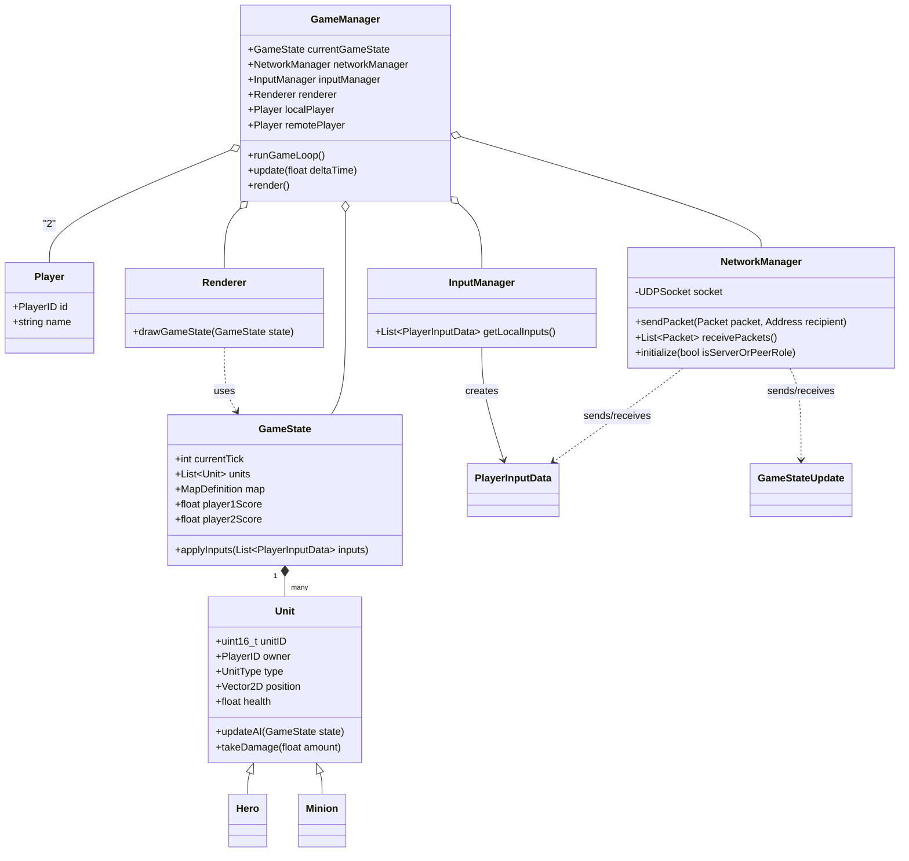

# Mini RTS Arena

## Analiza projektu z przedmiotu Przetwarzanie Rozproszone

## Autorzy: Yauheni Pyryeu 201253, Matsvei Kasparovich 201627

## Data: 10-04-2025

***

## 1. Wstęp

Celem projektu jest stworzenie prototypu gry strategicznej czasu rzeczywistego (RTS) online dla dwóch graczy. Gra osadzona jest w perspektywie top-down 2D na niewielkiej arenie. Każdy gracz bezpośrednio kontroluje jedną jednostkę-bohatera oraz pośrednio zarządza grupą podległych mu jednostek (tak zwanych "minionów"). Jednostki (bohaterowie i miniony) mogą pełnić funkcje Łucznika lub Miecznika. Kluczowym założeniem technicznym jest wykorzystanie protokołu **UDP** do komunikacji sieciowej oraz zbadanie implementacji w architekturach **Klient-Serwer** oraz **Peer-to-Peer (P2P)**.

***

## 2. Architektura Sieciowa

W projekcie rozważane i badane są dwie architektury sieciowe, obie wykorzystujące protokół UDP:

### 2.1. Klient-Serwer (Client-Server)

*   **Opis:** Dedykowany serwer jest **autorytatywnym źródłem stanu gry**. Klienci wysyłają akcje (input) do serwera. Serwer symuluje grę, rozstrzyga konflikty i rozsyła aktualny stan do klientów.
*   **Zalety:**
    *   Łatwiejsze zarządzanie stanem gry i synchronizacją.
    *   Łatwiejsze zapobieganie oszustwom (cheating).
    *   Centralna walidacja akcji.
*   **Wady:**
    *   Pojedynczy punkt awarii (SPoF).
    *   Potencjalnie wyższe opóźnienie (przez pośrednika).
    *   Wymaga zasobów do hostowania serwera.

### 2.2. Peer-to-Peer (P2P)

*   **Opis:** Klienci komunikują się bezpośrednio. Wymaga to **deterministycznej** symulacji i synchronizacji akcji graczy (np. model "lockstep"). Każdy klient wysyła swoje akcje i czeka na akcje przeciwnika dla danego kroku (ticka) przed wykonaniem symulacji.
*   **Zalety:**
    *   Potencjalnie niższe opóźnienia.
    *   Brak centralnego serwera (brak SPoF, brak kosztów serwera).
*   **Wady:**
    *   Znacznie trudniejsza synchronizacja (ryzyko desynchronizacji).
    *   Problemy z NAT Traversal.
    *   Bardzo podatna na oszustwa.
    *   Wymaga 100% deterministycznej symulacji.

### 2.3. Architektura naszego Projektu

Projekt ma na celu **zbadanie obu podejść**, aby porównać ich złożoność implementacyjną, wydajność i problemy związane z synchronizacją przy użyciu UDP w kontekście gry RTS.

***

## 3. Model Komunikacji

### 3.1. Protokół

Wybrano **UDP** ze względu na priorytet niskich opóźnień. Własne mechanizmy będą implementowane dla zapewnienia niezawodności/kolejności tam, gdzie to konieczne (np. dla krytycznych akcji gracza w P2P).

### 3.2. Format Wiadomości

Preferowany jest **zwarty format binarny** nad tekstowym (np. JSON) dla minimalizacji narzutu pakietów UDP. Każdy pakiet rozpoczyna się 1-bajtowym `PacketID`.

**Podstawowe Struktury Danych (Przykłady C++):**
%% TODO: REFACTOR %%
```cpp
struct Vector2D { float x, y; };
enum UnitType : uint8_t { SWORDSMAN = 0, ARCHER = 1 };
enum PlayerID : uint8_t { PLAYER_1 = 0, PLAYER_2 = 1 };

struct UnitState {
  uint16_t unitID;       // Unikalne ID jednostki
  PlayerID owner;
  UnitType type;
  Vector2D position;
  float health;
  // uint8_t stateFlags; // Np. isAttacking, isMoving
  // uint16_t targetID; // ID celu ataku/ruchu
};

struct PlayerInputData { // Dane specyficzne dla akcji gracza
    uint8_t inputType;     // 0: HeroMove, 1: HeroAttackUnit, 2: MinionGroupCommand, etc.
    Vector2D targetPosition;
    uint16_t targetUnitID;
    uint8_t numMinions;
    uint16_t minionIDs[]; // Flexible array member or handled via packet length
};
```

### 3.3. Kluczowe Komunikaty (Format Binarny - Pola Przykładowe)

*   `PacketID = 0x01`: **PlayerInput** (Klient -> Serwer)
    *   `uint32_t sequenceNumber;` // Numer sekwencyjny pakietu od klienta
    *   `uint32_t gameTick;`       // Tick, dla którego klient *przewiduje* wykonanie akcji (może być mniej istotne w C/S niż P2P)
    *   `PlayerInputData data;`    // Właściwe dane akcji

*   `PacketID = 0x02`: **GameStateUpdate** (Serwer -> Klient)
    *   `uint32_t gameTick;`       // Tick stanu serwera
    *   `uint32_t lastProcessedInputSeq;` // Ostatni numer sekwencyjny inputu tego klienta przetworzony przez serwer
    *   `uint16_t numUnits;`       // Liczba jednostek w aktualizacji
    *   `UnitState units[];`      // Tablica stanów jednostek (pełna lub delta)
    *   `float player1Score;`
    *   `float player2Score;`

*   `PacketID = 0x03`: **JoinRequest** (Klient -> Serwer)
    *   `char playerName[16];`    // Nazwa gracza

*   `PacketID = 0x04`: **JoinConfirm / GameInfo** (Serwer -> Klient)
    *   `PlayerID assignedPlayerID;`
    *   `uint32_t initialGameTick;`
    *   `// Info o mapie, początkowe jednostki`

	%% TODO: LobbyCreate, LobbyConnect %%

*   `PacketID = 0x05`: **Ping** (Klient -> Serwer)
    *   `uint64_t clientTimestamp;` // Czas wysłania przez klienta

*   `PacketID = 0x06`: **Pong** (Serwer -> Klient)
    *   `uint64_t clientTimestamp;` // Oryginalny timestamp z Ping
    *   `uint64_t serverTimestamp;` // Czas przetworzenia przez serwer

*   `PacketID = 0x07`: **Acknowledge (ACK)** (Serwer -> Klient, opcjonalne, np. dla ważnych wiadomości od serwera)
    *   `// Dane potwierdzanej wiadomości`

***

## 4. Działanie Aplikacji

### 4.1. Z Punktu Widzenia Użytkownika

1.  Uruchomienie gry.
2.  Wybór trybu (Klient-Serwer / P2P).
3.  TODO: Lobby
4.  Połączenie / Oczekiwanie na gracza.
5.  Rozpoczęcie rozgrywki.
6.  Kontrola bohatera (np. WASD/mysz).
7.  Wydawanie komend minionom (zaznaczenie miniona, zaznaczenie celu).
8.  Zakończenie gry, wyniki.

### 4.2. Z Punktu Widzenia Systemu (Klient-Serwer)

1.  Serwer startuje, nasłuchuje.
2.  Klient wysyła `JoinRequest`.
3.  Serwer akceptuje, odsyła `JoinConfirm/GameInfo`.
4.  **Pętla Gry:**
    *   Klient zbiera input, wysyła `PlayerInput` do serwera (z `sequenceNumber`).
    *   Serwer (wątki `ClientConnection`) odbiera inputy, umieszcza w `InputQueue`.
    *   Serwer (główny wątek) wykonuje **tick symulacji**:
        *   Pobiera wszystkie dostępne inputy z `InputQueue`.
        *   Aktualizuje autorytatywny `GameState` (ruch, walka, AI, kolizje).
        *   Notuje ostatni przetworzony `sequenceNumber` dla każdego klienta.
    *   Serwer wysyła `GameStateUpdate` (z `gameTick` i `lastProcessedInputSeq`) do obu klientów.
    *   Klient odbiera `GameStateUpdate`.
    *   Klient aktualizuje lokalny stan gry, godząc go ze stanem serwera (może odrzucić lokalne predykcje niepotwierdzone przez serwer).
    *   Klient renderuje grę (ew. z predykcją/interpolacją).

### 4.3. Z Punktu Widzenia Systemu (P2P - Lockstep)

1.  Klienci odkrywają się (np. LAN broadcast).
2.  Wymiana `JoinRequest/JoinConfirm`, ustalenie `initialGameTick`.
3.  **Pętla Gry (Lockstep Tick N):**
    *   Klient zbiera input dla przyszłego ticka `N+k` (k - margines na opóźnienie).
    *   Klient wysyła `PlayerInput(Tick=N+k)` do peera.
    *   Klient czeka na `PlayerInput(Tick=N)` od peera.
    *   **Gdy oba inputy dla ticka N są dostępne:**
        *   Klient wykonuje **deterministyczną symulację ticka N** używając inputów *obu* graczy.
        *   Klient aktualizuje lokalny stan gry.
    *   Klient renderuje stan po ticku N.
    *   Klienci wymieniają ACK dla potwierdzenia odbioru `PlayerInput`.
    *   Okresowa wymiana PING/PONG do pomiaru RTT.

***

## 5. Potencjalne Problemy i Rozwiązania (UDP)

*   **Utrata pakietów:**
    *   **`PlayerInput` (krytyczne w P2P):** ACK + Retransmisja lub Nadmiarowość. W C/S serwer po prostu nie wykona akcji, klient zauważy brak jej efektu w `GameStateUpdate`.
    *   **`GameStateUpdate` (C/S):** Utrata mniej krytyczna, kolejny update nadpisze stan. Numer ticka i `lastProcessedInputSeq` pomagają klientowi utrzymać spójność.
*   **Zła kolejność pakietów:**
    *   Numery sekwencyjne (dla inputu klienta) i numery ticków (dla stanu serwera) pozwalają na odrzucenie przestarzałych danych. W C/S serwer przetwarza inputy w kolejności ich otrzymania lub wg logiki buforowania.
*   **Duplikaty pakietów:**
    *   Numery sekwencyjne/ticków pozwalają łatwo wykryć i odrzucić duplikaty.
*   **Oszustwa (Cheating):**
    *   **C/S:** Łatwiejsze do kontroli. Serwer waliduje akcje (np. czy ruch jest możliwy, cooldowny) i jest autorytatywny.
    *   **P2P:** Bardzo trudne do zapobiegania.
*   **Synchronizacja (P2P):**
    *   **Determinizm:** Kluczowy. Użycie liczb stałoprzecinkowych, zsynchronizowanego RNG.
*   **Opóźnienia (Latency):**
    *   **C/S:** Client-Side Prediction, Interpolation/Extrapolation.
    *   **P2P (Lockstep):** Opóźnienie zależne od RTT i marginesu `k`.

***

## 6. Schemat Działania / Symulacja Gry

Gra działa w oparciu o stały krok czasowy (Fixed Timestep), np. 30-60 ticków/s.

**Pętla Główna Serwera (C/S, uproszczona):**
1.  `ProcessNetworkInputs()`: (Wątki ClientConnection) Odbieraj `PlayerInput`, sprawdzaj, umieszczaj w `InputQueue`. Obsługuj Ping, Join itp.
2.  `UpdateGameState(deltaTime)`: (Główny wątek, co stały interwał)
    *   Pobierz wszystkie inputy z `InputQueue` dla bieżącego ticka.
    *   Wykonaj symulację ticka:
        *   Zastosuj inputy graczy do `GameState`.
        *   Aktualizuj AI, ruch, fizykę, walkę.
    *   Zwiększ `gameTick`.
3.  `SendNetworkOutputs()`: (Główny wątek lub dedykowany)
    *   Przygotuj `GameStateUpdate` (pełny lub delta).
    *   Roześlij `GameStateUpdate` do wszystkich `ClientConnection`.
    *   Wyślij Pong, ACK itp.
4.  Powtórz.

***

## 7. Sekcje Krytyczne i Synchronizacja

*   **`GameState` (na serwerze C/S):** Dostęp musi być synchronizowany. Główny wątek symulacji jest jedynym "pisarzem". Wątki sieciowe mogą potrzebować bezpiecznego odczytu (np. do wysłania stanu) lub kopiowania.
*   **`InputQueue` (na serwerze C/S):** Musi być bezpieczna wątkowo (multiple producers - wątki `ClientConnection`, single consumer - główny wątek symulacji).

***

## 8. Diagramy Sekwencji

### 8.1. P2P Lockstep Tick


### 8.2. Klient-Serwer Game Loop Tick


***

## 9. Diagramy Klas

### 9.1. Diagram Klas Ogólny (Uproszczony)



### 9.2. Diagram Klas - Strona Serwera (Architektura Klient-Serwer)


***

## 10. Opis Klas

*   **GameManager:** (Klient/P2P) Główna klasa zarządzająca pętlą gry po stronie klienta lub w trybie P2P.
*   **ServerApp:** (Serwer) Punkt startowy aplikacji serwera, tworzy główne komponenty serwera.
*   **NetworkServer:** (Serwer) Zarządza nasłuchiwaniem na połączenia, tworzeniem i zarządzaniem obiektami `ClientConnection`.
*   **ClientConnection:** (Serwer) Reprezentuje pojedyncze połączenie z klientem na serwerze. Zazwyczaj działa we własnym wątku, odbiera dane od klienta, umieszcza je w `InputQueue` i wysyła `GameStateUpdate` do klienta.
*   **ServerGameManager:** (Serwer) Główna klasa logiki serwera, uruchamia pętlę gry, pobiera inputy z kolejki, zleca symulację i rozgłasza stan gry.
*   **GameState:** Kontener na stan gry (jednostki, mapa, tick, wyniki). W C/S jest to *autorytatywny* stan na serwerze. W P2P każdy peer ma swoją kopię.
*   **SimulationEngine:** (Serwer/P2P) Odpowiada za wykonanie jednego kroku symulacji gry, modyfikując `GameState` na podstawie inputów. Musi być deterministyczny dla P2P.
*   **InputQueue:** (Serwer) Bezpieczna wątkowo kolejka do przekazywania `PlayerInput` z wątków sieciowych (`ClientConnection`) do głównego wątku serwera (`ServerGameManager`).
*   **Unit, Hero, Minion:** Klasy reprezentujące jednostki w grze.
*   **Player:** Reprezentuje gracza.
*   **NetworkManager:** (Klient/P2P) Klasa obsługująca sieć po stronie klienta lub w trybie P2P.
*   **InputManager:** (Klient/P2P) Zbiera input od lokalnego gracza.
*   **Renderer:** (Klient/P2P) Rysuje stan gry.

***